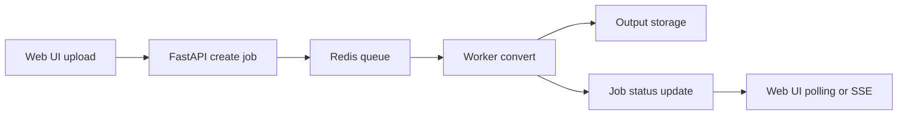

# Bambam Converter Suite Web App Migration Plan

## Scope

- V1 includes image, video, sound, and document conversion
- Batch rename is excluded from V1
- Deployment target is self-hosted Docker for single-user or family use
- Auth can be minimal or omitted in the first release

## Feasibility Decision

This project can be converted into a self-hosted web app. The correct strategy is not to wrap the current Tkinter desktop UI, but to separate conversion logic from the desktop presentation layer and rebuild the interface as a browser-based application.

Relevant current entry points:

- `[BambamConverterSuite](../bambam_converter_suite.py:25)` orchestrates the Tkinter shell and tabs
- `[ImageTab](../image_tab.py:29)` contains image conversion state and logic
- `[VideoTab](../video_tab.py:102)` contains FFmpeg-based video workflows
- `[SoundTab](../sound_tab.py:31)` contains FFmpeg-based audio workflows
- `[DocumentTab](../document_tab.py:31)` contains document conversion workflows and engine detection

## Recommended Architecture

### Core stack

- Frontend: Next.js
- Backend API: FastAPI
- Background jobs: Python worker process
- Queue: Redis
- Metadata store: SQLite for V1
- File storage: local Docker volumes

### Runtime services

- `frontend` for the web UI
- `api` for uploads, job creation, job status, and downloads
- `worker` for long-running conversion tasks
- `redis` for job queueing

### Storage model

- `/data/uploads` for raw uploads
- `/data/outputs` for converted files and zip bundles
- `/data/db` for SQLite database files

### Processing flow

## Desktop to Web Mapping

### Image conversion

Reusable parts:

- image format mapping in `[IMAGE_FORMAT_MAP](../image_tab.py:15)`
- Pillow-based conversion logic in `[ImageTab](../image_tab.py:29)`

Rewrite required:

- Tkinter widgets and local file selection in `[ImageTab._build_ui](../image_tab.py:69)`

### Video conversion

Reusable parts:

- FFmpeg command resolution in `[get_ffmpeg_cmd](../video_tab.py:24)`
- FFprobe command resolution in `[get_ffprobe_cmd](../video_tab.py:32)`
- command builder in `[build_ffmpeg_cmd](../video_tab.py:48)`

Rewrite required:

- crop preview, timeline preview, and Tkinter event interactions in `[VideoTab._build_ui](../video_tab.py:167)`

### Sound conversion

Reusable parts:

- FFmpeg command resolution in `[get_ffmpeg_cmd](../sound_tab.py:15)`
- bitrate and target format flow in `[SoundTab](../sound_tab.py:31)`

Rewrite required:

- Tkinter progress UI and local interactions in `[SoundTab._build_ui](../sound_tab.py:50)`

### Document conversion

Reusable parts:

- document input types in `[DOC_INPUT_EXTS](../document_tab.py:23)`
- target formats in `[DOCUMENT_TARGET_FORMATS](../document_tab.py:29)`

Redesign required:

- Windows COM detection in `[DocumentTab._detect_engine_blocking](../document_tab.py:65)`
- Word-based path must be dropped for Docker Linux runtime
- LibreOffice headless should become the only supported V1 document engine

## Technical Decisions

### 1. Rebuild the UI for web

The tab notebook in `[BambamConverterSuite.__init__](../bambam_converter_suite.py:25)` is desktop-specific and should be replaced with:

- top navigation or sidebar
- separate pages for image, video, sound, and document tools
- shared job history and downloads screen

### 2. Extract conversion services

Target backend layout:

- `[backend/app/main.py](../backend/app/main.py)`
- `[backend/app/api/routes/convert.py](../backend/app/api/routes/convert.py)`
- `[backend/app/api/routes/jobs.py](../backend/app/api/routes/jobs.py)`
- `[backend/app/services/image_service.py](../backend/app/services/image_service.py)`
- `[backend/app/services/video_service.py](../backend/app/services/video_service.py)`
- `[backend/app/services/audio_service.py](../backend/app/services/audio_service.py)`
- `[backend/app/services/document_service.py](../backend/app/services/document_service.py)`
- `[backend/app/workers/jobs.py](../backend/app/workers/jobs.py)`

### 3. Use job-based execution

Long-running work such as video and document conversion should not run inside a synchronous HTTP request. The API should create jobs and the worker should execute them asynchronously.

### 4. Replace source-folder semantics

Desktop mirror mode assumes direct access to the user file system. In the web app, the safer V1 model is:

- uploaded files are stored under a job folder
- converted results are stored under an output folder
- user downloads a zip result
- optional host export path can be added later

## Docker Strategy

### API and worker image contents

- Python runtime
- FFmpeg
- FFprobe
- LibreOffice headless
- Python dependencies for API and conversion services

### Compose goal

`[docker-compose.yml](../docker-compose.yml)` should allow the full stack to start with one command.

## Risks and Constraints

### Low risk

- image conversion
- audio conversion
- basic video conversion

### Medium risk

- large file upload handling
- progress reporting for jobs
- output cleanup and retention

### High risk

- consistent document conversion behavior in Docker
- advanced crop and trim UX for video in browser
- storage usage for large video jobs

### Important blockers to address

1. `[DocumentTab._detect_engine_blocking](../document_tab.py:65)` uses Windows-specific Word COM and cannot be used in Docker Linux
2. synchronous subprocess patterns such as `[subprocess.run](../video_tab.py:91)` must move into worker execution
3. bundled Windows binaries `[ffmpeg.exe](../ffmpeg.exe)` and `[ffprobe.exe](../ffprobe.exe)` should not be used in Linux containers
4. delete-original and mirror semantics must be redefined to avoid unsafe server-side filesystem behavior

## Execution Phases

### Phase 1

- create backend and frontend project skeletons
- add Docker Compose and base Dockerfiles
- add health endpoints and landing page
- prepare shared data directories and config structure

### Phase 2

- implement image conversion API and worker path
- add upload form and download result flow
- persist job records in SQLite

### Phase 3

- implement sound conversion
- add job history and job detail pages

### Phase 4

- implement video conversion
- add progress parsing and status updates
- keep advanced crop and trim features out of the first pass if needed

### Phase 5

- implement document conversion with LibreOffice headless only
- harden error handling and unsupported file responses

### Phase 6

- improve UX
- add cleanup policies
- add basic local settings and optional lightweight auth gate

## Actionable Build Checklist for Code Mode

- create `[backend/](../backend)` FastAPI app skeleton
- create `[frontend/](../frontend)` Next.js app skeleton
- create `[docker-compose.yml](../docker-compose.yml)` and initial container config
- add API health route and frontend landing page
- create worker bootstrap with Redis integration
- define upload and output volume layout
- begin Phase 1 only, without implementing converters yet

## Approval Status

This plan is approved by the user and saved for implementation handoff.
